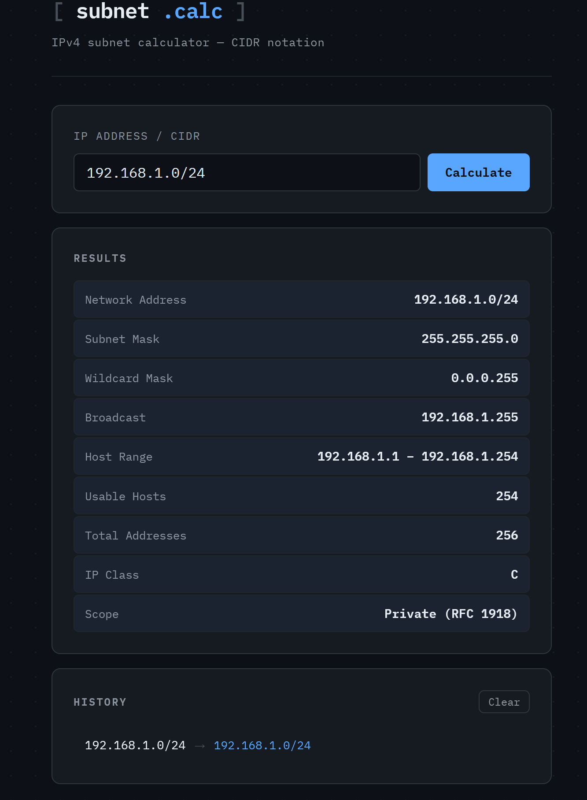

[](https://github.com/mrdrisk/Portfolio-Subnet-Calculator/actions/workflows/ci.yml)
[](https://mrdrisk.github.io/Portfolio-Subnet-Calculator)
# subnet.calc
 
A browser-based IPv4 subnet calculator built with vanilla HTML, CSS, and JavaScript. No dependencies, no frameworks — just clean networking logic and a sharp UI.
 

 
---
 
## Features
 
- **Full CIDR support** — enter any IPv4 address in CIDR notation (e.g. `10.0.0.0/8`)
- **Complete subnet breakdown** — network address, broadcast, subnet mask, wildcard mask, host range, and usable host count
- **Edge case handling** — correct treatment of `/31` (RFC 3021 point-to-point) and `/32` (host routes)
- **IP classification** — detects class (A/B/C/D/E) and private vs. public scope (RFC 1918)
- **Calculation history** — last 20 queries saved to localStorage, clickable to re-run
- **Zero dependencies** — pure JS, no build step required
## Usage
 
Clone the repo and open `frontend/index.html` in any browser:
 
```bash
git clone https://github.com/mrdrisk/Portfolio-Subnet-Calculator.git
cd Portfolio-Subnet-Calculator
open frontend/index.html   # macOS
xdg-open frontend/index.html  # Linux
```
 
Or serve it locally:
 
```bash
python3 -m http.server 8080 --directory frontend
# then visit http://localhost:8080
```
 
### Example
 
Input: `192.168.1.10/24`
 
| Field | Value |
|---|---|
| Network Address | 192.168.1.0/24 |
| Subnet Mask | 255.255.255.0 |
| Wildcard Mask | 0.0.0.255 |
| Broadcast | 192.168.1.255 |
| Host Range | 192.168.1.1 – 192.168.1.254 |
| Usable Hosts | 254 |
| IP Class | C |
| Scope | Private (RFC 1918) |
 
## Project Structure
 
```
Portfolio-Subnet-Calculator/
├── frontend/
│   ├── index.html      # Markup and page structure
│   ├── style.css       # Styling
│   ├── subnet.js       # Core subnet logic (pure functions, no DOM)
│   └── script.js       # UI controller and history management
├── cli/                # Python CLI version
├── test/               # Unit tests
├── docs/               # Documentation and screenshots
└── .github/workflows/  # CI pipeline
```
 
## How It Works
 
The core logic lives entirely in `subnet.js` as pure functions with no side effects:
 
- `ipToInt(ip)` — converts a dotted-quad IPv4 string to a 32-bit integer
- `intToIp(int)` — converts a 32-bit integer back to dotted-quad
- `calculateSubnet(cidr)` — takes a CIDR string and returns a full subnet info object
This separation means the logic can be tested independently and reused in other contexts (like the Python CLI) without touching the DOM.
 
## Skills Demonstrated
 
This project was built to demonstrate practical knowledge across the stack:
 
- **Networking** — IPv4 addressing, CIDR notation, subnet masks, broadcast domains, RFC 1918, RFC 3021
- **JavaScript** — bitwise operations, pure functions, DOM manipulation, localStorage
- **HTML/CSS** — semantic markup, responsive layout, CSS custom properties
- **Git** — conventional commits, structured project layout
- **Linux** — local development and serving via Python's built-in HTTP server
## Roadmap
 
- [ ] VLSM / subnet splitting
- [ ] IPv6 support
- [ ] Export results as JSON or CSV
- [ ] Python CLI parity with frontend features
## Author
 
**Matt Driscoll** — [@mrdrisk](https://github.com/mrdrisk)
 
Aspiring IT/DevOps engineer. Currently studying for CCNA. Building cloud and networking projects to break into the field.
 
---
 
*Part of an ongoing portfolio. See my other projects at [github.com/mrdrisk](https://github.com/mrdrisk).*
